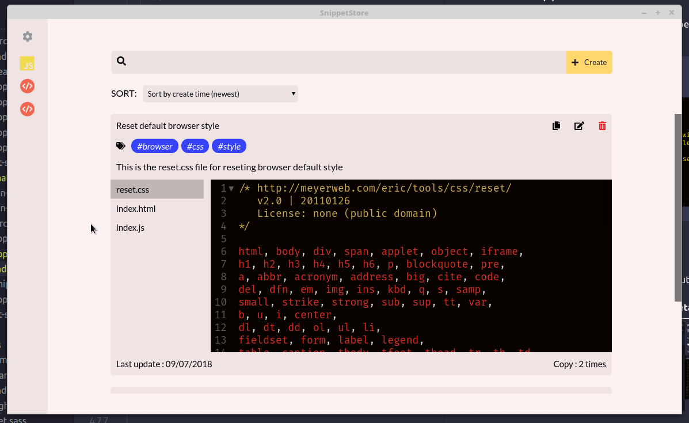

<h1 align='center'>SnippetStore</h1>
<p align='center'>
<i>:tada: A snippet management app for developers :rocket:</i>
</p>
<p align='center'>
  <a href='https://twitter.com/intent/tweet?text=Wow!&hashtags=SnippetStore&url=https%3A%2F%2Fgithub.com%2FZeroX-DG%2FSnippetStore'>
    
  </a>
</p>
<p align='center'>

<a href='https://github.com/ZeroX-DG/SnippetStore/releases'>
  
</a>
<a href='https://github.com/ZeroX-DG/SnippetStore/releases'>
  
</a>
<a href='https://github.com/ZeroX-DG/SnippetStore/stargazers'>
  
</a>
<a href='https://github.com/ZeroX-DG/SnippetStore/network'>
  
</a>
</p>

<p align='center'>
  
</p>

## About this project

SnippetStore is a application for developers to store their snippets and quickly retrieve them when needed. SnippetStore mainly focus on storing code therefor its interface is small and simple, perfect for busy developers who doesn't care about small details.

## Donate

There are many requests for macOS support and I'm sure many of you guys who are mac users will want
SnippetStore to be available in homebrew and able to run on macOS too. But in order to do that, I need help from you guys to afford a mac to test & build this project and many more other projects in the future. It would be a huge help if you can buy me a coffee :smile:

<a href="https://www.buymeacoffee.com/hQteV8A" target="_blank"></a>

## Download

Currently SnippetStore only available for linux and windows.

If you're using MacOS, you can also build a version for you OS too (not guarantee it will work!)

```
npm run dist:mac
```

You can get the latest release of SnippetStore [here](https://github.com/ZeroX-DG/SnippetStore/releases)

## Theme

SnippetStore currently support 2 themes dark and light

| Light theme                                        | Dark theme                                        |
| -------------------------------------------------- | ------------------------------------------------- |
|  |  |

## Tag support

With SnippetStore you can assign multiple tags to your snippet and easy find them using the tag list on the right bar

<p align='center'>
  
</p>

## Multi file snippet

Not satisfied with a single file snippet? With SnippetStore you can now store multiple files within a snippet

<p align='center'>
  
</p>

## Snippet list layout

SnippetStore currently support 2 snippet list layout:

| Original                                                     | List and details                                                    |
| ------------------------------------------------------------ | ------------------------------------------------------------------- |
|  |  |

## Internalization

SnippetStore currently support 2 languages:

- English
- Vietnamese

## Shortcut

| Action                    | Key                            |
| ------------------------- | ------------------------------ |
| Open create snippet modal | ctrl + n                       |
| Open setting modal        | ctrl + ,                       |
| Toggle small sidebar mode | ctrl + b                       |
| Close all modal           | esc                            |
| Save snippet              | ctrl + s                       |
| Discard snippet changes   | esc                            |
| Navigate in snippet list  | ctrl + pageup, ctrl + pagedown |

## Tech Stack

- Framework: [Electron](https://electronjs.org/)
- Bundler: [Webpack](https://webpack.js.org/), [Babel](https://babeljs.io/), [Electron-builder](https://github.com/electron-userland/electron-builder)
- Language: [ES6](https://babeljs.io/learn-es2015/), [Sass](http://sass-lang.com/)
- Library: [React](https://reactjs.org/), [MobX](https://mobx.js.org/), [Mousetrap](https://craig.is/killing/mice), [react-toastify](https://fkhadra.github.io/react-toastify/), [react-tooltip](http://wwayne.com/react-tooltip/), [CodeMirror](https://github.com/codemirror/CodeMirror)
- Lint: [ESLint](https://eslint.org/)
- Test: [Jest](https://facebook.github.io/jest/)

## Contributing

Check out [contributing.md](contributing.md)

## Author & Maintainer

- [Hung Nguyen](https://github.com/ZeroX-DG) ([twitter](https://twitter.com/ZeroX_Hung))
