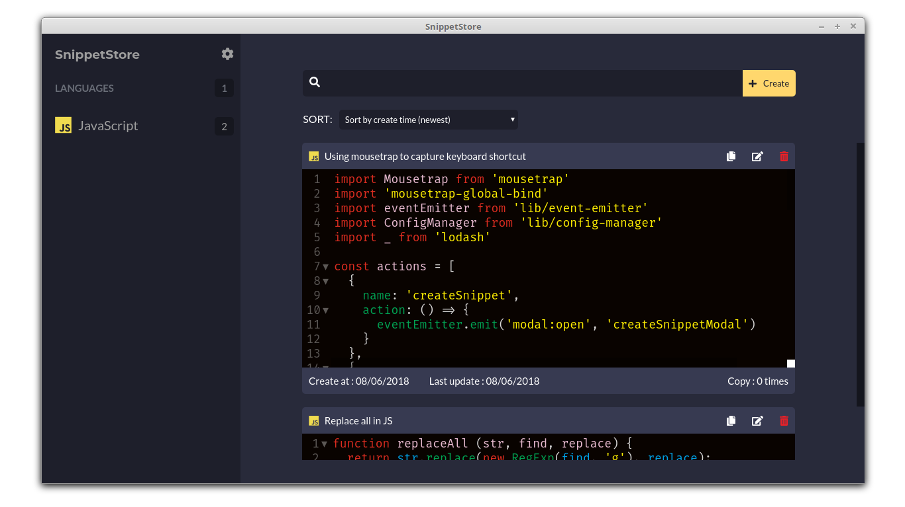
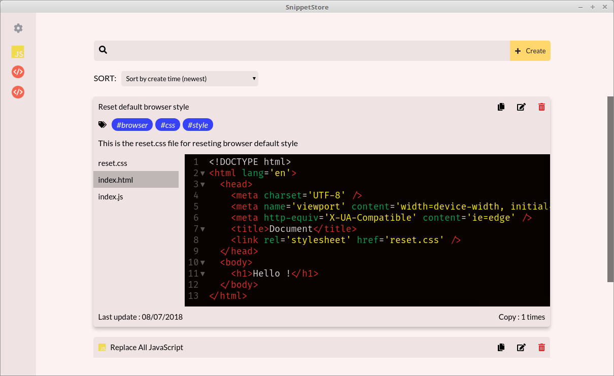
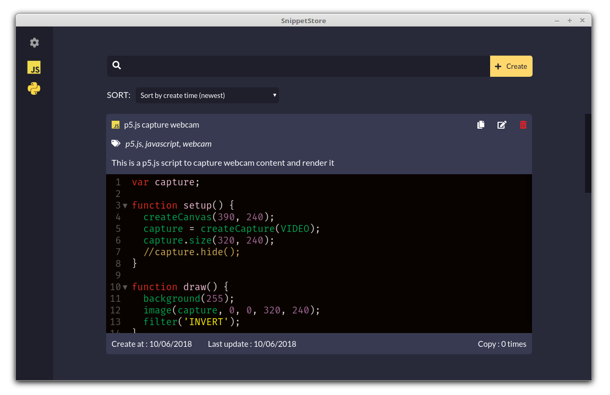

  

<h1 align='center'>SnippetStore</h1>

<i>A snippet management app for developers</i>

## About this project
SnippetStore is a application for developers to store their snippets and quickly retrieve them when needed. SnippetStore mainly focus on storing code therefor its interface is small and simple, perfect for busy developers who doesn't care about small details.

## Download
You can get the latest release of SnippetStore [here](https://github.com/ZeroX-DG/SnippetStore/releases)

1. Download it and unzip it
2. Run it

## Theme
SnippetStore currently support 2 themes dark and light

| Light theme                                        | Dark theme                                        |
|----------------------------------------------------|---------------------------------------------------|
|  |  |

## Internalization
SnippetStore currently support 2 languages:
- English
- Vietnamese

## Shortcut
| Action                    | Key      |
|---------------------------|----------|
| Open create snippet modal | ctrl + n |
| Open setting modal        | ctrl + , |

## Tech Stack
- Framework: [Electron](https://electronjs.org/)
- Bundler: [Webpack](https://webpack.js.org/), [Babel](https://babeljs.io/), [Electron-packager](https://github.com/electron-userland/electron-packager)
- Language: [ES6](https://babeljs.io/learn-es2015/), [Sass](http://sass-lang.com/)
- Library: [React](https://reactjs.org/), [MobX](https://mobx.js.org/), [Mousetrap](https://craig.is/killing/mice), [react-toastify](https://fkhadra.github.io/react-toastify/), [react-tooltip](http://wwayne.com/react-tooltip/)
- Lint: [ESLint](https://eslint.org/)
- Test: [Jest](https://facebook.github.io/jest/)

## Contributing
Check out [contributing.md](contributing.md)

## Author & Maintainer
- [Hung Nguyen](https://github.com/ZeroX-DG)
